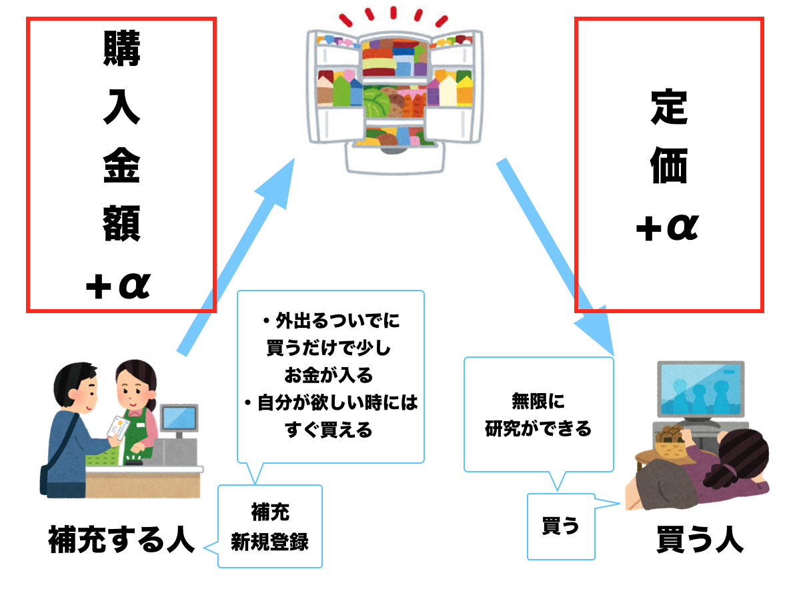
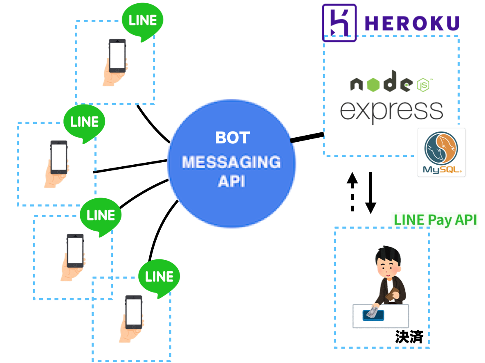
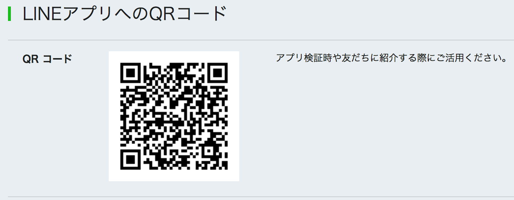

# LabEleven
~ ハッカソンでeslint使うやつまじで0人説 ~
研究室にコンビニ導入したい！！

# 1. 概要

## 1.1 購入者
1. LineBotに対して商品番号を送る（ex: ```購入 1```)
2. Botから支払いするように命じられる
3. oneClickで購入

### メリット
+ 購入者にとっては, 研究室にいながら, ものが買える
+ まじで楽やんけ！
### デメリット
割高

## 1.2 補充者
1. LineBotに対して商品番号を送る（e: ```登録 1```）
2. Botから金額が支払われる（現状APIがないので、月末返還がよさそう）（ログを見ればすべて取引履歴がわかる）
3. お金を受け取る

### メリット
+ どこか行くついでに物を買うと, ```定価+α```のお金が貰える
+ 冷蔵庫にストックできる
+ いっぱい買っても後悔がない（欲しい時には自分で買い戻せばいいし、いらないなら、勝手に売れる）
### デメリット
+ めんどくさい




## 1.3 備考
+ 差額の+αが貯まれば、みんなで鍋パやりたい

# 2. 開発技術
+ Nodejs + express
+ herokuにdeploy
+ DBはMySQL
+ LINE MESSAGE API
+ LINE PAY API



# 3. 参考
+ https://www.npmjs.com/package/line-pay

# 4. Please Test me


### おまけ
+ もしも、No thanksおさずに鯖更新した時は, switchのスコープコメントアウトして、以下を実行する
```
// No thanks押し忘れた時用
const message = {
	type: "template",
	altText: "You need to purchase subscription to use this Chatbot. It's 1yen/month. Do you want to puchase?",
	template: {
		type: "confirm",
		text: "You need to purchase subscription to use this Chatbot. It's 1yen/month. Do you want to purchase?",
		actions: [
			{type: "postback", label: "Yes", data: "yes"},
			{type: "postback", label: "No Thanks", data: "no"}
		]
	}
};
return bot.replyMessage(event.replyToken, message).then((response) => {
	cache.put(event.source.userId, {
		subscription: "inactive"
	});
});
```
